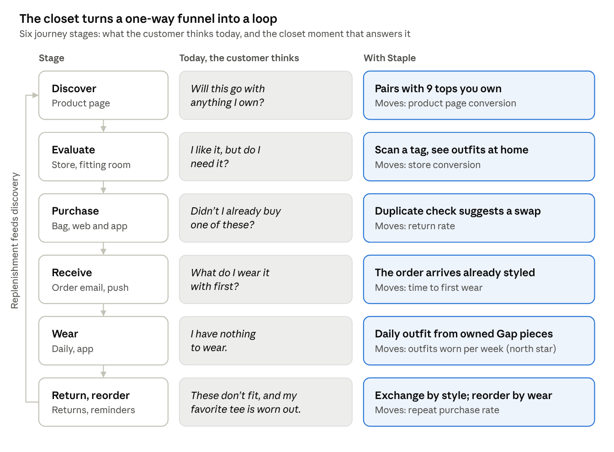
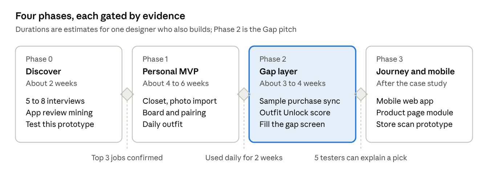

# Staple — Product Strategy & Plan (v0, Gap concept)

> **Snapshot.** This is the strategy as it stood at milestone `v0-gap-concept` (Oct 6, 2026), when the project was a closet concept built for Gap Inc. Self-initiated concept, not affiliated with Gap Inc.

Oct 6, 2026 · Denise ([dango-design](https://github.com/dango-design))

## Summary

Staple (working name) is a closet and outfit planner that turns a customer's Gap Inc. purchase history into a styled digital wardrobe, then recommends the one Gap piece that unlocks the most new outfits. The thesis: Gap sells the staples that hold outfits together, so Gap is the brand best placed to own the moment a customer gets dressed.

- **For customers:** digitize a closet in minutes because Gap Inc. purchases sync automatically, plan outfits on a visual canvas, and wear more of what they already own.
- **For Gap:** a first-party relationship that keeps running between orders, with recommendations grounded in the customer's real closet. Owned Gap pieces are styled first; new Gap pieces are ranked by how many outfits they unlock.
- **For this application:** a working prototype plus this plan show customer-journey design end to end, from purchase to wear to re-purchase, online and in store.

The tagline that frames every decision: **Style what you own. Shop what's missing.**

## Why Gap, why now

Gap Inc. already has the loyalty base, the purchase data and a stated strategy to personalize. What it lacks is a first-party place where the customer's own closet lives, and Staple is a design for that place.

- **The role is about journeys.** The [Sr UX Designer – Customer Journey Experience Design](https://www.gapinc.com/en-us/jobs/w22/7/sr-ux-designer-%e2%80%93-customer-journey-experience-desig) listing covers the end-to-end experience for two brands, from discovery through post-purchase. It asks for a portfolio showing "end-to-end journey thinking rather than a collection of screens." Staple centers on post-purchase, the stage most portfolios skip.
- **Loyalty is now one program.** [Encore](https://gapinc.com/en-us/articles/2026/02/gap-inc-launches-encore,-a-new-and-more-rewarding-) launched on Feb 24, 2026 across all four brands with nearly 40M active members, and lists styling guidance and extended returns among its perks. Staple is one way to deliver the styling perk.
- **First-party personalization is the strategy.** Gap Inc.'s [FY2025 annual report](https://www.sec.gov/Archives/edgar/data/39911/000162828026018573/gap-20260131.htm) commits to raising loyalty members' lifetime value through personalization built on first-party data. A closet built from purchase history is that data, made useful to the customer.
- **Gap is already testing styling-led shopping.** On Oct 5, 2026, Gap brand [launched an experience with Alta Daily](https://www.gapinc.com/en-us/articles/2026/10/30-years-after-putting-fashion-online,-gap-inc-loo), an AI closet app, turning personal style into curated looks with Gap products. Staple explores the owned-channel version, where the customer's real purchases seed the closet. Gap's release does not say whether Alta uses the customer's existing closet.
- **Essentials are driving the turnaround.** Gap brand comparable sales rose 10% in [Q2 FY2026](https://www.sec.gov/Archives/edgar/data/0000039911/000162828026059262/q22026eprexhibit991.htm) (May to Jul 2026), and the Fall 2026 campaign [Denim on your own](https://gapinc.com/en-us/articles/2026/08/gap-launches-denim-on-your-own,-a-fall-2026-campai) frames denim as a canvas for personal style. Essentials pair with everything, which is what the Outfit Unlock score rewards.
- **Digital is large enough to matter.** Online was 39% of [FY2025](https://www.sec.gov/Archives/edgar/data/39911/000162828026015208/q42025eprexhibit991.htm) (Feb 2025 to Jan 2026) net sales of $15.4B.

**How the concept answers the listing**

| What the role asks for | Where Staple shows it |
| --- | --- |
| Own end-to-end journeys across discovery, evaluation, purchase and post-purchase | A six-stage journey map with a closet moment at each stage |
| Connect digital, store and emerging channels | gap.com product-page module, in-store tag scan, pickup for gap-filling picks |
| Decide what is shared across brands and what stays brand-distinct | One closet and ranking engine across Gap Inc.; each brand's app leads with its own products |
| Tie design decisions to metrics | Every principle maps to a metric, measured against a holdout group |
| Validate concepts before build | Interview and usability-test plan in the case study |
| Accessibility, trust and compliance from the start | Labeled shop items, a switch to hide shopping, opt-in purchase sync |
| Use AI to move faster | AI photo tagging in the product; AI-assisted synthesis and prototyping in the process |

## Problem & opportunity

Getting a closet into an app is the hardest step, and every closet app makes the customer do it by hand. Gap Inc. already holds that data for its own customers.

**The customer problem**

- **Closets go unworn.** Across 10M+ tracked items, the average [Indyx closet](https://www.myindyx.com/blog/the-state-of-our-wardrobes-is-concerning) holds 166 items, and 25% go unworn in a year. [WRAP UK](https://www.circularonline.co.uk/?p=57037) found a similar 26%.
- **Returns are expensive.** [NRF and Happy Returns](https://www.ajot.com/news/consumers-expected-to-return-nearly-850-billion-in-merchandise-in-2025) estimate 19.3% of 2025 US online sales were returned. [Coresight](https://coresight.com/research/the-true-cost-of-apparel-returns-alarming-return-rates-require-loss-minimization-solutions) puts online apparel returns at 24.4%, with size and fit the top reason at 53%.
- **Customers are open to retailer-trained styling.** In an [Algolia survey](https://www.mytotalretail.com/article/could-ai-be-your-next-stylist-consumers-are-ready) of 1,000 US adults, 64% were interested in an AI personal shopper trained on their favorite retailer's data.

**The landscape**

| Player | What it does well | What it misses for a retailer |
| --- | --- | --- |
| [Indyx](https://myindyx.com/how-it-works) | Background removal, outfit boards, calendar, cost-per-wear, human stylists | Setup is manual; it sells a $295 in-home cataloguing service to fix that |
| [Whering](https://whering.co.uk/) | Free, 10M+ users, large item database, AI daily outfits | Not connected to any retailer's purchase data |
| [Acloset](https://www.acloset.app/) | AI stylist using weather and schedule; says it imports purchase history from some retailers | Third-party; no single brand's catalog behind its suggestions |
| [Alta](https://menlovc.com/perspective/agentic-styling-and-shopping-why-were-backing-alta/) | Email and receipt import with product images; avatar try-on | Third-party; Gap is a guest in someone else's closet |
| [Stitch Fix Shop Your Looks](https://newsroom.stitchfix.com/?p=1091) | Recommends items that go with pieces kept from past Fixes | Only knows what Stitch Fix sold you; no full closet |
| [Zalando assistant](https://corporate.zalando.com/en/node/10755) | Uses shopping history to personalize answers | Conversational; no visual closet or outfit planning |

**Where Gap Inc. can win**

1. **Solve cold start with purchase sync.** Gap Inc. has item-level order history with clean product images, sizes and colors across four brands, including store purchases linked to Encore.
2. **Put "goes with what you own" on product pages and in the bag.** Only Stitch Fix offers a version of this, and only inside its own service.
3. **Bring the closet into stores.** Scan a tag to see what it pairs with at home; no competitor was found doing this.
4. **Welcome other brands.** Photo, link and receipt import keep the closet complete, or it becomes a catalog instead of a closet.

## Customers

Three customer types share one job: get dressed with confidence using what they own, and buy only what earns a place. A fourth row captures what Gap needs from the same experience. These are proto-personas; validate them with 5 to 8 interviews before the case study (see Portfolio packaging).

| Persona | Who they are | Job to be done | What Staple gives them |
| --- | --- | --- | --- |
| The Gap Regular | Encore member who buys Gap and Old Navy basics several times a year, often online | When I'm getting dressed in a rush, help me pull together something that works so I don't default to the same three outfits | A closet that builds itself from past orders, plus a daily outfit using pieces they forgot they own |
| The Intentional Buyer | Wants fewer, better clothes; tracks cost-per-wear; wary of being sold to | When I'm considering a purchase, show me it works with what I own so I don't waste money or return it | Duplicate warnings, an honest Outfit Unlock count on every suggestion, and a switch to hide shopping |
| The Occasion Planner | Has a trip, new job or event coming up | When something is on my calendar, help me plan the looks and tell me the one thing I'm missing | A weekly planner tied to weather and events, with gap-filling picks they can buy online or pick up in store |
| Gap (the business) | Brand, merchandising, loyalty and digital teams | Grow repeat purchase and loyalty without leaning on discounts, and cut costly returns | Purchase-grounded recommendations, a reason to open the app between orders, and pre-purchase confidence that should lower returns |

## The end-to-end journey

Staple adds a closet moment at every stage of the journey, so post-purchase becomes the start of the next purchase instead of the end of the last one.



Each closet moment answers the customer's thought at that stage and moves one metric; replenishment loops back into discovery. The prototype's "Across the journey" screen shows a mock of each moment.

## Product principles

Six principles settle most design debates, especially the tension between helping the customer and selling to them.

1. **Closet first, cart second.** Every recommendation starts from something the customer owns. A new item appears only when it completes something.
2. **Earn the sale with value, not volume.** New Gap items are ranked by how many outfits they unlock, not by how many we can show. One strong suggestion beats ten weak ones.
3. **Zero-effort start.** Gap Inc. purchases arrive photographed, named and tagged. The customer never re-enters what Gap already knows.
4. **Always show the honest option.** If an owned piece works, it appears before anything for sale. Near-duplicates are flagged before checkout, not after delivery.
5. **The customer holds the controls.** Shopping suggestions are labeled, can be switched off, and closet data stays inside Gap Inc.
6. **One closet, every channel.** The same closet powers the app, gap.com product pages, the store, and post-purchase moments like order emails and returns.

## Experience & MVP scope

The MVP is four screens: Closet, Today, Outfit builder and Fill the gap. Together they prove the full loop from owned clothes to a recommended purchase. The interactive prototype lives in this project at `mockup/index.html`, and its "Design notes" switch overlays numbered rationale on every screen.

| Screen | Customer moment | What the prototype shows | Scope |
| --- | --- | --- | --- |
| Closet and purchase sync | "Getting my clothes in is a chore" | Gap Inc. orders sync with photos, sizes and colors; photo, link and receipt import for other brands; a badge showing where each item came from | MVP |
| Today | "What do I wear?" | A daily outfit explained by weather and calendar; Rediscover for under-worn Gap pieces; one Fill the gap card | MVP |
| Outfit builder | "Will this work together?" | A slot-based flat-lay board, a live pairing check, Complete the look ranked Gap-first, and try-on of shop items with price | MVP |
| Fill the gap | "What should I buy next?" | Picks ranked by Outfit Unlock, a reason on each, pickup or ship, and what was not recommended and why | MVP |
| Planner | "This week, and this trip" | Week view tied to calendar and forecast; trip packing with one gap and an honest alternative | V2 |
| Insights | "Is my closet working?" | Outfits possible, utilization, cost-per-wear, least-worn pieces | V2 |
| Across the journey | Product page, store, bag, order email, returns | Closet moments at six journey stages, plus what is shared across brands and what stays brand-specific | Concept |

**Demo customer.** Jordan, an Encore member in San Francisco, owns 24 pieces: 16 synced from Gap Inc. brands and 8 added by photo or link. The prototype's rule engine finds 100 outfits in that closet. Straight Khakis unlock 26 more, while both Gap jackets score zero because Jordan's trench, denim jacket and puffer already cover every outfit.

## Recommendation strategy

Recommendations are **Gap-first, never Gap-only**: owned Gap pieces are styled first, other owned pieces still appear, and new Gap items are ranked by the outfits they unlock. Hiding the customer's other clothes would make every suggestion feel like an ad, and the customer would stop trusting the closet.

| Tier | Source | Ranked by | Label the customer sees |
| --- | --- | --- | --- |
| 1 | Owned Gap Inc. items | Fit with the outfit, then a boost for under-worn and recently bought pieces | From your closet · Gap |
| 2 | Owned items from other brands | Fit with the outfit | From your closet |
| 3 | New Gap items | Outfit Unlock score, filtered to the customer's size and in-stock | Shop Gap · unlocks N outfits |
| 4 (later) | Old Navy, Banana Republic, Athleta | Same as tier 3, when Gap has no strong match | Shop Gap Inc. brands |

**Outfit Unlock score.** For a candidate item, count the complete outfits it creates with pieces the customer already owns. A complete outfit is one top, one bottom and one pair of shoes (or a dress and shoes), optionally with a layer, that passes the compatibility check. The ranking then adjusts for style fit, size availability and duplication:

```
Rank(c) = Unlock(c) × S(c) × A(c) × (1 − D(c))
```

Here S is style affinity (learned from saved and worn outfits), A is availability in the customer's size, and D is similarity to something already owned. A high D blocks the suggestion and shows "You already own something like this" instead.

**Compatibility, in three stages.**

1. **Rules (MVP):** slot logic (one bottom per outfit), color harmony with neutrals as wildcards, matching formality, and season.
2. **Learning from the customer:** saved, worn and skipped outfits tune the weights for that person.
3. **Learning from Gap:** Gap's own styled looks and "complete the look" pairings become training data for a pairing model across the catalog.

**Every suggestion explains itself** in one line, for example: "Pairs with 9 of your tops and 3 pairs of shoes. You don't own a light-wash bottom."

**Guardrails.** At most one shop suggestion per outfit slot and three per screen. No countdown timers or fake scarcity. Price is shown up front. The "Show shopping suggestions" switch is one tap away on every screen that sells.

## Success metrics

The north star is **outfits worn per active customer per week**, because a customer who gets dressed with Staple keeps coming back, and every visit is a chance to style an owned Gap piece or fill a real gap. Business impact is measured against a holdout group that never sees closet-based recommendations, so the lift is incremental rather than assumed.

| Metric | Type | Definition | Why it matters |
| --- | --- | --- | --- |
| Outfits worn per active customer per week | North star | Outfits marked worn or followed from the daily suggestion | Habit and value delivered |
| Time to first outfit | Customer | Minutes from sign-up to first saved outfit | Proves the purchase sync solves cold start |
| Closet utilization | Customer | Share of owned items worn in the last 90 days | The "nothing to wear" problem, measured |
| Recommendation conversion | Business | Purchases within 14 days of a Shop Gap suggestion, per suggestion seen | Whether unlock-ranked picks sell |
| Purchase frequency | Business | Orders per customer per year vs. holdout | Repeat purchase and loyalty |
| Return rate on Staple-influenced orders | Business | Returned units over purchased units vs. holdout | Pre-purchase confidence should cut returns |
| Gap share of outfits | Business | Share of worn outfits that include a Gap Inc. item | Gap's place in the customer's daily life |
| Shopping switched off | Guardrail | Share of customers who hide shop suggestions | Early warning that it feels like an ad |
| Suggestion dismissals | Guardrail | Shop suggestions dismissed per suggestion seen | Relevance and trust |
| Duplicate purchases | Guardrail | Orders flagged as near-duplicates of owned items | Whether the honest option is working |

Targets are set after a four-week baseline; the case study should present them as hypotheses with the experiment design, not as results.

## Risks, ethics and open questions

The biggest risk is that Staple reads as an ad disguised as a utility; most mitigations protect that trust.

| Risk | Why it matters | Mitigation |
| --- | --- | --- |
| Feels like a sales funnel | Customers abandon tools that push; the closet loses its value as a habit | Gap-first, never Gap-only ranking; labeled shop items; a switch to hide shopping; guardrail metrics watched weekly |
| Privacy of closet and purchase data | Wardrobe, size and purchase data are personal | Explicit opt-in to purchase sync; data stays in Gap Inc.; plain-language controls to export and delete |
| Non-Gap items still need photos | Cold start is only half solved for customers who shop elsewhere | Photo capture with automatic background removal and AI tagging; paste a product link; forward an email receipt |
| Weak outfit pairings | One bad suggestion undermines every later one | Start with conservative rules; learn from saves, wears and skips; let customers say "not for me" |
| Fewer purchases if people re-wear more | Cannibalization worry from merchandising | Bet on loyalty, conversion and lower returns over volume; prove it with a holdout test |
| Inclusive sizing and bodies | Suggestions that ignore fit exclude customers | Filter by the customer's sizes; show items on varied models; never assume gender from a closet |
| Older purchases lack images | Synced items need clean product photos | Use archived catalog imagery; fall back to a category illustration the customer can replace |

**Open questions to resolve with Gap stakeholders**

- [ ] Ship as a standalone app, or as a "My Closet" tab inside the Gap app and gap.com?
- [ ] Which Gap Inc. brands sync at launch: Gap only, or all four?
- [ ] Does catalog imagery exist for past seasons, and in a flat-lay format?
- [ ] What consent language does legal require to use purchase history for styling?
- [ ] How should Staple reward Encore members, for example points for planning or wearing outfits?

## Roadmap & build plan

Build in four phases, each gated by evidence, so the case study shows validated decisions rather than just a finished app. Phase 2, the Gap layer, is what the portfolio pitches; Phases 0 and 1 make it credible.



Each gate is a test, not a date: the next phase starts only when its criteria are met.

Phase 1 starts by porting the prototype's `engine.js` (pairing rules and the Outfit Unlock score) into the app, so the logic in the mockup is the logic that ships. The Gap catalog stays a hand-built, illustrative sample rather than data scraped from a retailer's site.

**Tech stack**

| Layer | Choice | Why |
| --- | --- | --- |
| App | Next.js with React and TypeScript, hosted on Vercel | Web first, with a direct path to an installable mobile web app |
| Data, login, photos | Supabase (Postgres, Auth, Storage) | One service for closet data, images and accounts; row-level security keeps each closet private |
| Background removal | @imgly/background-removal, run in the browser | Free, and photos never leave the device |
| Photo tagging and reasons | Claude API with vision | Tags category, color, pattern and formality from a photo; drafts the one-line reasons |
| Outfit board | dnd-kit | Accessible drag and drop for the slot board |
| Weather | Open-Meteo | Free forecast for the daily outfit |

**Data model**

| Table | Key fields |
| --- | --- |
| items | user, name, brand, category, type, colors, pattern, formality, seasons, source (sync, photo, link, receipt), price, size, purchased on, image |
| outfits | user, name, occasion, items with their slots |
| wear_log | date, outfit or item |
| catalog_products | SKU, brand, name, category, color, price, sizes in stock, image |
| recommendations | catalog product, unlock count, score, reason, shown at, outcome (dismissed, tried, bought) |

## Portfolio packaging

Present Staple as a self-initiated concept backed by real research. Make the journey map the proof of journey thinking the listing asks for, and the prototype the centerpiece. Label every page "self-initiated concept, not affiliated with Gap Inc."

**Case-study structure**

1. **Hook:** one line ("Style what you own. Shop what's missing.") and a hero image of Today.
2. **Role and constraints:** self-initiated; you owned research, strategy, UX, UI, prototyping and the front-end build.
3. **Problem:** the customer pain (unworn closets, costly returns) and the business pain (loyalty value between orders).
4. **Research:** interviews, review mining and the competitive scan, ending in the cold-start insight.
5. **Strategy:** the thesis, Gap-first never Gap-only, and the six principles.
6. **Journey map:** today vs. with Staple across six stages, with the metric each moment moves.
7. **Process:** sketches, flows and two or three iterations that changed because of testing.
8. **The product:** a 90-second walkthrough plus annotated screens for Closet, Builder and Fill the gap.
9. **The engine:** how Outfit Unlock works, shown with Jordan's closet (100 outfits, +26 from khakis, 0 from jackets).
10. **Measuring success:** north star, guardrails and the holdout test design.
11. **What's next:** platform rollout across brands, and what you would test first at Gap.

**Artifacts to produce**

- [ ] Ask the recruiter which two brands the role covers, and confirm the location (the gapinc.com page and the Workday posting disagree)
- [ ] Interview 5 to 8 people who shop Gap Inc. brands; capture quotes for the problem section
- [ ] Tag 100+ app-store reviews of Indyx, Whering and Acloset by pain point
- [ ] Usability-test the prototype with 5 people; show the top three fixes as before and after
- [ ] Record a 90-second walkthrough with Design notes switched on
- [ ] Export hero images: Today, the builder mid-try-on, Fill the gap, and the journey screen
- [ ] Write a three-sentence summary for the cover letter

**Interview talking points**

- **Post-purchase is where the relationship lives.** Most journeys end at checkout; this one starts there.
- **Value-ranked recommendations.** Outfit Unlock ranks by value created for the customer, which is easier to defend than ranking by margin.
- **Trust is a feature.** The duplicate check and "what we didn't recommend" trade a little short-term revenue for lower returns and lasting trust.
- **Shared platform, brand-distinct.** One closet and engine across Gap Inc.; each brand leads with its own catalog and voice.

## Sources

Gap Inc.

- [Sr UX Designer – Customer Journey Experience Design listing](https://www.gapinc.com/en-us/jobs/w22/7/sr-ux-designer-%e2%80%93-customer-journey-experience-desig) and [Workday posting R219227](https://gapinc.wd1.myworkdayjobs.com/GAPINC/job/SF---2-Folsom/Sr-UX-Designer---Customer-Journey-Experience-Design_R219227)
- [Gap Inc. launches Encore (Feb 2026)](https://gapinc.com/en-us/articles/2026/02/gap-inc-launches-encore,-a-new-and-more-rewarding-)
- [Gap Inc. FY2025 annual report (10-K)](https://www.sec.gov/Archives/edgar/data/39911/000162828026018573/gap-20260131.htm)
- [Q4 and FY2025 results release](https://www.sec.gov/Archives/edgar/data/39911/000162828026015208/q42025eprexhibit991.htm)
- [Q2 FY2026 results release](https://www.sec.gov/Archives/edgar/data/0000039911/000162828026059262/q22026eprexhibit991.htm)
- [Gap Inc. AI shopping experiences, including Alta Daily (Oct 2026)](https://www.gapinc.com/en-us/articles/2026/10/30-years-after-putting-fashion-online,-gap-inc-loo)
- [Gap launches Denim on your own (Aug 2026)](https://gapinc.com/en-us/articles/2026/08/gap-launches-denim-on-your-own,-a-fall-2026-campai)

Market and competitors

- [Indyx: the state of our wardrobes](https://www.myindyx.com/blog/the-state-of-our-wardrobes-is-concerning) and [how Indyx works](https://myindyx.com/how-it-works)
- [WRAP UK wardrobe research, via Circular Online](https://www.circularonline.co.uk/?p=57037)
- [NRF and Happy Returns 2025 returns estimate, via AJOT](https://www.ajot.com/news/consumers-expected-to-return-nearly-850-billion-in-merchandise-in-2025)
- [Coresight: the true cost of apparel returns](https://coresight.com/research/the-true-cost-of-apparel-returns-alarming-return-rates-require-loss-minimization-solutions)
- [Algolia AI personal shopper survey, via Total Retail](https://www.mytotalretail.com/article/could-ai-be-your-next-stylist-consumers-are-ready)
- [Whering](https://whering.co.uk/), [Acloset](https://www.acloset.app/), [Alta (Menlo Ventures)](https://menlovc.com/perspective/agentic-styling-and-shopping-why-were-backing-alta/), [Stitch Fix Shop Your Looks](https://newsroom.stitchfix.com/?p=1091), [Zalando assistant](https://corporate.zalando.com/en/node/10755)
