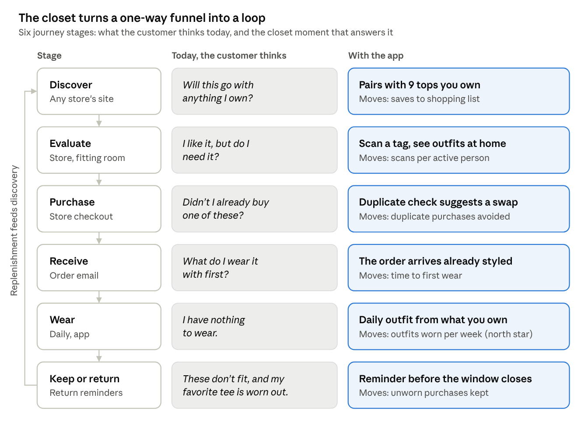
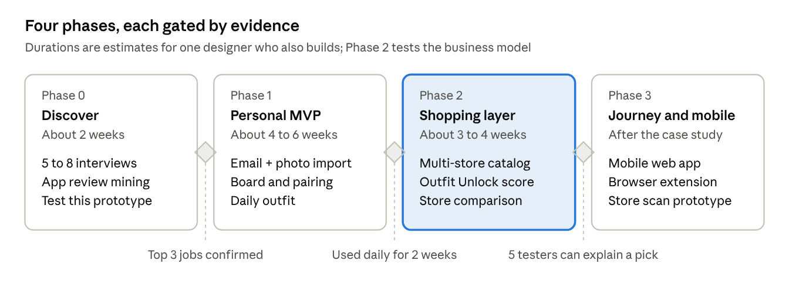

# Outfit Builder (working title) — Product Strategy & Plan (v1, multi-store)

> **Snapshot.** This is the strategy as it stood at milestone `v1-multi-store` (Oct 6, 2026), after [decision 002](../process/decisions/002-public-multi-store-app.md) turned the project into a public app for all major retailers. The earlier Gap concept is in [v0-gap-concept.md](v0-gap-concept.md).

Oct 6, 2026 · Denise ([dango-design](https://github.com/dango-design))

## Summary

Outfit Builder (working title) is a public closet and outfit planner. It builds itself from your order emails at any major store, styles what you already own, and recommends the one piece that would unlock the most new outfits, with options from several stores. It is not tied to any retailer.

- **For people:** a closet that fills itself from order confirmations, a daily outfit from what you own, and shopping advice that is honest about what you actually need.
- **How it earns trust:** pieces are ranked only by the value they add to your closet. Stores are listed by your favorites, then price. Any commission is disclosed and never changes the ranking.
- **For the portfolio:** an end-to-end journey across discovery, purchase, wear and returns, with a documented pivot from a Gap-only concept to a public app (see Decision log).

The tagline that frames every decision: **Style what you own. Shop what's missing.**

## Why now

Retailers are racing to add AI styling, but each one styles only its own catalog. People's closets come from many stores, and no one connects that whole closet to honest shopping advice.

- **Retailers are betting on styling.** On Oct 5, 2026, Gap brand [launched a styling experience with Alta Daily](https://www.gapinc.com/en-us/articles/2026/10/30-years-after-putting-fashion-online,-gap-inc-loo), an AI closet app. [Stitch Fix](https://newsroom.stitchfix.com/?p=1091) recommends items that go with pieces clients kept, and [Zalando's assistant](https://corporate.zalando.com/en/node/10755) uses shopping history.
- **Those efforts stop at one store.** A neutral closet can recommend across stores, which is what a real closet looks like.
- **AI makes the hard parts practical.** Reading order emails, removing photo backgrounds, tagging category and color, and explaining a recommendation in one line are now cheap enough for a small team.
- **Cold start is still unsolved for most apps.** [Indyx](https://myindyx.com/how-it-works) sells a $295 in-home cataloguing service because adding clothes by hand is the step people abandon.

## Problem & opportunity

Getting a closet into an app is the hardest step, and most closet apps make people do it by hand. Order-confirmation emails already describe most of what someone owns, with photos, sizes and colors.

**The customer problem**

- **Closets go unworn.** Across 10M+ tracked items, the average [Indyx closet](https://www.myindyx.com/blog/the-state-of-our-wardrobes-is-concerning) holds 166 items, and 25% go unworn in a year. [WRAP UK](https://www.circularonline.co.uk/?p=57037) found a similar 26%.
- **Returns are expensive.** [NRF and Happy Returns](https://www.ajot.com/news/consumers-expected-to-return-nearly-850-billion-in-merchandise-in-2025) estimate 19.3% of 2025 US online sales were returned. [Coresight](https://coresight.com/research/the-true-cost-of-apparel-returns-alarming-return-rates-require-loss-minimization-solutions) puts online apparel returns at 24.4%, with size and fit the top reason at 53%.
- **People are open to AI styling.** In an [Algolia survey](https://www.mytotalretail.com/article/could-ai-be-your-next-stylist-consumers-are-ready) of 1,000 US adults, 64% were interested in an AI personal shopper trained on their favorite retailer's data.

**The landscape**

| Player | What it does well | Where this concept differs |
| --- | --- | --- |
| [Indyx](https://myindyx.com/how-it-works) | Background removal, outfit boards, calendar, cost-per-wear, receipt forwarding, human stylists | Ranks possible purchases by the outfits they unlock in your closet, across stores |
| [Whering](https://whering.co.uk/) | Free, 10M+ users, large item database, AI daily outfits | Explains every pick, and shows what it chose not to recommend |
| [Acloset](https://www.acloset.app/) | AI stylist using weather and schedule; says it imports purchase history from some retailers | Commissions are disclosed and kept out of the ranking |
| [Alta](https://menlovc.com/perspective/agentic-styling-and-shopping-why-were-backing-alta/) | Email and receipt import with product images; avatar try-on | Recommends the kind of piece first, then compares stores |
| [Stitch Fix Shop Your Looks](https://newsroom.stitchfix.com/?p=1091) | Recommends items that go with pieces kept from past Fixes | Works with clothes from any store, not one retailer's |
| [Zalando assistant](https://corporate.zalando.com/en/node/10755) | Uses shopping history to personalize answers | A visual closet and outfit planner, not only a chat |

**Where this can win**

1. **Solve cold start from the inbox.** Order emails from major stores carry product photos, sizes and colors, so most of a closet arrives without typing.
2. **Recommend pieces, not products.** Decide what kind of piece the closet is missing, then let people compare stores, prices and their size at each.
3. **Show up wherever people shop.** A browser extension on any store's product page, a tag scan in a fitting room, and a duplicate check at checkout.
4. **Be honest about money.** Disclose commissions, keep them out of the ranking, and let people switch shopping off.

## Customers

Three customer types share one job: get dressed with confidence using what they own, and buy only what earns a place. These are proto-personas; validate them with 5 to 8 interviews before the case study (see Portfolio packaging).

| Persona | Who they are | Job to be done | What the app gives them |
| --- | --- | --- | --- |
| The Multi-Store Regular | Buys basics from a handful of stores, such as Gap, Uniqlo and Levi's, mostly online | When I'm getting dressed in a rush, help me pull together something that works so I don't default to the same three outfits | A closet that builds itself from order emails, plus a daily outfit using pieces they forgot they own |
| The Intentional Buyer | Wants fewer, better clothes; tracks cost-per-wear; wary of being sold to | When I'm considering a purchase, show me it works with what I own so I don't waste money or return it | Duplicate warnings, an honest unlock count, store comparison in their size, and a switch to hide shopping |
| The Occasion Planner | Has a trip, new job or event coming up | When something is on my calendar, help me plan the looks and tell me the one thing I'm missing | A weekly planner tied to weather and events, with gap-filling pieces from several stores |

## The end-to-end journey

The app adds a closet moment at every stage of shopping, at any store, so a purchase becomes the start of the next outfit instead of the end of the journey.



Each closet moment answers the customer's thought at that stage and moves one metric; replenishment loops back into discovery. The prototype's "Across the journey" screen shows a mock of each moment.

## Product principles

Six principles settle most design debates, especially the tension between helping the customer and selling to them.

1. **Closet first, cart second.** Every recommendation starts from something the person owns. A new piece appears only when it completes something.
2. **Piece first, store second.** Recommend the kind of piece that adds the most outfits, then let people choose the store. One strong suggestion beats ten weak ones.
3. **Zero-effort start.** Order emails from major stores arrive photographed, named, sized and tagged. Photos and links cover the rest.
4. **Always show the honest option.** If an owned piece works, it appears before anything for sale. Near-duplicates are flagged before checkout, not after delivery.
5. **The person holds the controls.** Shopping can be switched off, commissions are disclosed and never change the ranking, and the closet is never sold or shared with stores.
6. **One closet, everywhere people shop.** The same closet shows up on any store's product page, in a fitting room, at checkout and in the return window.

## Experience & MVP scope

The MVP is four screens: Closet, Today, Outfit builder and Fill the gap. Together they prove the full loop from owned clothes to a well-chosen purchase. The interactive prototype is in this repo under `mockup/`, and its "Design notes" switch overlays numbered rationale on every screen.

| Screen | Customer moment | What the prototype shows | Scope |
| --- | --- | --- | --- |
| Closet and email import | "Getting my clothes in is a chore" | Order emails from 15 stores become closet pieces with photos and sizes; photo and link import for the rest; a badge showing where each item came from | MVP |
| Today | "What do I wear?" | A daily outfit explained by weather and calendar; Rediscover for under-worn pieces; one Fill the gap card | MVP |
| Outfit builder | "Will this work together?" | A slot-based flat-lay board, a live pairing check, owned pieces least-worn first, and try-on of a suggested piece before choosing a store | MVP |
| Fill the gap | "What should I buy next?" | Pieces ranked by Outfit Unlock, a reason on each, store options with your size at each store, a shopping list grouped by store, and what was not recommended | MVP |
| Planner | "This week, and this trip" | Week view tied to calendar and forecast; trip packing with one gap and an honest alternative | V2 |
| Insights | "Is my closet working?" | Outfits possible, utilization, cost-per-wear, least-worn pieces, pieces by store | V2 |
| Across the journey | Product page, store, checkout, order email, returns | Closet moments at six stages of shopping, plus the rules that keep the app neutral | Concept |

**Demo customer.** Jordan owns 24 pieces from 15 stores: 20 imported from order emails and 4 added by photo or link. The prototype's rule engine finds 100 outfits in that closet. Light straight chinos unlock 26 more, from $39.90 at three stores, while two jackets score zero because Jordan's trench, denim jacket and puffer already cover every outfit.

## Recommendation strategy

Recommendations are **piece first, store second**: the app decides what kind of piece would add the most to the closet, then lists matching options from several stores. No store can pay for placement, and owned pieces always come before anything for sale.

| Step | What happens | Ranked by | What the person sees |
| --- | --- | --- | --- |
| 1 | Owned pieces that complete an outfit | Fit with the outfit, least-worn first | From your closet |
| 2 | Missing pieces | Outfit Unlock score, adjusted for style, size availability and duplication | Unlocks N new outfits |
| 3 | Store options for a piece | The person's favorite stores first, then price | Store, product, price, and their size at that store |

**Outfit Unlock score.** For a candidate piece, count the complete outfits it creates with pieces the person already owns. A complete outfit is one top, one bottom and one pair of shoes (or a dress and shoes), optionally with a layer, that passes the compatibility check. A new layer only counts outfits that no owned layer already works with. The ranking then adjusts for style fit, size availability and duplication:

```
Rank(c) = Unlock(c) × S(c) × A(c) × (1 − D(c))
```

Here S is style affinity (learned from saved and worn outfits), A is availability in the person's size, and D is similarity to something already owned. A high D blocks the suggestion and shows "You already own something like this" instead. Commission is not a term in the formula.

**Compatibility, in three stages.**

1. **Rules (MVP):** slot logic (one bottom per outfit), color harmony with neutrals as wildcards, matching formality, and season.
2. **Learning from the person:** saved, worn and skipped outfits tune the weights for that person.
3. **Learning from everyone, with consent:** outfits people save and wear train a pairing model that works across stores.

**Size memory.** Each store option shows the size to buy there, taken from past orders at that store or inferred from similar brands when there is no history. Size and fit are the top reason for apparel returns.

**Every suggestion explains itself** in one line, for example: "Pairs with 9 of your tops and 3 pairs of shoes. You don't own a light-colored bottom yet."

**Guardrails.** At most one suggested piece per outfit slot and three per screen. No countdown timers or fake scarcity. Prices are shown up front. A disclosure about ranking and commissions sits next to every list of store options, and the "Show shopping suggestions" switch is one tap away on every screen that sells.

## Success metrics

The north star is **outfits worn per active person per week**, because a person who gets dressed with the app keeps coming back, whether or not they buy anything. Revenue is tracked, but as a result of good recommendations rather than a target that shapes them.

| Metric | Type | Definition | Why it matters |
| --- | --- | --- | --- |
| Outfits worn per active person per week | North star | Outfits marked worn or followed from the daily suggestion | Habit and value delivered |
| Time to first outfit | Experience | Minutes from sign-up to first saved outfit | Proves email import solves cold start |
| Email import accuracy | Experience | Share of clothing orders imported with the right item, size and color | The main technical risk |
| Closet utilization | Experience | Share of owned items worn in the last 90 days | The "nothing to wear" problem, measured |
| Kept rate on recommended pieces | Value | Recommended pieces bought and not returned, over those bought | Whether picks are actually right |
| Duplicate purchases avoided | Value | Checkouts where the duplicate warning led to a change | The honest option, working |
| Revenue per active person | Business | Disclosed commissions per active person per month | Sustainability without ads |
| Shopping switched off | Guardrail | Share of people who hide shopping suggestions | Early warning that it feels like an ad |
| Suggestion dismissals | Guardrail | Suggested pieces dismissed per piece shown | Relevance and trust |

Targets are set after a four-week baseline, and ranking changes are tested with A/B experiments. The case study should present targets as hypotheses with the experiment design, not as results.

## Risks, ethics and open questions

The biggest risks are that the app reads as an ad disguised as a utility, and that inbox access feels invasive; most mitigations protect trust.

| Risk | Why it matters | Mitigation |
| --- | --- | --- |
| Feels like a sales funnel | People abandon tools that push; the closet loses its value as a habit | Piece-first ranking; commissions disclosed and kept out of the ranking; a switch to hide shopping; guardrail metrics watched weekly |
| Inbox access feels invasive | Email is very personal, and a breach would be serious | Read only order confirmations from clothing stores; show exactly what was imported; delete everything on disconnect; offer receipt forwarding instead |
| Receipt formats vary by store | Imports fail or mislabel items | Start with the largest stores; let people correct items in one tap; product links and photos as fallbacks |
| Product data across stores | Suggestions need current prices, sizes and images | Use affiliate product feeds and retailer APIs; never scrape against a site's terms |
| Weak outfit pairings | One bad suggestion undermines every later one | Start with conservative rules; learn from saves, wears and skips; let people say "not for me" |
| Fewer purchases if people re-wear more | Revenue depends on purchases | Earn on fewer, better purchases with lower returns; the north star is outfits worn, not orders |
| Inclusive sizing and bodies | Suggestions that ignore fit exclude people | Filter by each person's sizes; show items on varied bodies; never assume gender from a closet |

**Open questions**

- [ ] Which inboxes at launch: Gmail only, or Gmail and Outlook?
- [ ] Which stores' receipts to support first, and how to measure import accuracy?
- [ ] Affiliate networks, or direct partnerships, for product data?
- [ ] Free with disclosed commissions, or also a paid tier with no shopping at all?
- [ ] The product's final name (working title: Outfit Builder)

## Roadmap & build plan

Build in four phases, each gated by evidence, so the case study shows validated decisions rather than just a finished app. Phases 0 and 1 make the closet worth opening every day; Phase 2, the shopping layer, tests the business model.



Each gate is a test, not a date: the next phase starts only when its criteria are met.

Phase 1 starts by porting the prototype's `engine.js` (pairing rules and the Outfit Unlock score) into the app, so the logic in the mockup is the logic that ships. The prototype's store offers are hand-written examples; the real app uses product feeds rather than scraping retailers' sites.

**Tech stack**

| Layer | Choice | Why |
| --- | --- | --- |
| App | Next.js with React and TypeScript, hosted on Vercel | Web first, with a direct path to an installable mobile web app |
| Data, login, photos | Supabase (Postgres, Auth, Storage) | One service for closet data, images and accounts; row-level security keeps each closet private |
| Email import | Gmail API with read-only access, filtered to order confirmations | Builds the closet without typing, while touching as little of the inbox as possible |
| Receipt reading, photo tagging, reasons | Claude API with vision | Extracts items from receipts; tags category, color, pattern and formality from photos; drafts the one-line reasons |
| Background removal | @imgly/background-removal, run in the browser | Free, and photos never leave the device |
| Product data | Affiliate product feeds | Current prices, sizes and images across stores, with disclosed commissions |
| Outfit board | dnd-kit | Accessible drag and drop for the slot board |
| Weather | Open-Meteo | Free forecast for the daily outfit |

**Data model**

| Table | Key fields |
| --- | --- |
| items | user, name, brand, store, category, type, colors, pattern, formality, seasons, source (email, photo, link), price, size, purchased on, image |
| outfits | user, name, occasion, items with their slots |
| wear_log | date, outfit or item |
| pieces | the kinds of item the engine can recommend: category, type, color, formality |
| store_offers | piece, store, product, price, sizes in stock, link, image |
| size_profile | user, store, category, size, source (past order or inferred) |
| recommendations | piece, unlock count, score, reason, shown at, outcome (dismissed, tried, bought, returned) |

## Portfolio packaging

Present this as a public app with a documented pivot. The Gap concept (v0) shows retail journey design; the move to a neutral app (v1) shows product judgment. The [process log](../process/README.md) holds every milestone's screens, strategy snapshot and decisions.

**Case-study structure**

1. **Hook:** one line ("Style what you own. Shop what's missing.") and a hero image of Today.
2. **Role and constraints:** self-initiated; you owned research, strategy, UX, UI, prototyping and the front-end build, working with Claude Code as a build partner.
3. **Problem:** unworn closets, costly returns, and the manual setup that makes people quit closet apps.
4. **Research:** interviews, review mining and the competitive scan, ending in the cold-start insight.
5. **v0, the Gap concept:** purchase sync and Gap-first ranking, and why it pitched well but couldn't be a real product.
6. **The pivot:** decision 002, from one retailer to every store, and what carried over.
7. **Strategy:** piece first, store second; the six principles; the disclosure.
8. **Journey map:** today vs. with the app across six stages, with the metric each moment moves.
9. **The product:** a 90-second walkthrough plus annotated screens for Closet, Builder and Fill the gap.
10. **The engine:** how Outfit Unlock works, shown with Jordan's closet (100 outfits, +26 from chinos, 0 from jackets).
11. **Measuring success:** north star, guardrails and the experiment design.
12. **What's next:** the build phases and what you would test first.

**Artifacts to produce**

- [ ] Ask the Gap recruiter which two brands the role covers, and confirm the location (the gapinc.com page and the Workday posting disagree)
- [ ] Interview 5 to 8 people who shop at several stores; capture quotes for the problem section
- [ ] Tag 100+ app-store reviews of Indyx, Whering and Acloset by pain point
- [ ] Usability-test the prototype with 5 people; show the top three fixes as before and after
- [ ] Record a 90-second walkthrough with Design notes switched on
- [ ] Use the milestone screenshots in the repo for before-and-after comparisons
- [ ] Choose the product name
- [ ] Write a three-sentence summary for the cover letter

**For the Gap application**

| What the role asks for | Where this project shows it |
| --- | --- |
| Own end-to-end journeys across discovery, evaluation, purchase and post-purchase | A six-stage journey map that runs through returns |
| Connect digital, store and emerging channels | Browser extension, in-store tag scan, order emails, daily notifications |
| Tie design decisions to metrics | Every journey moment and principle maps to a metric |
| Validate concepts before build | An evidence-gated roadmap; an interview and usability-test plan |
| Accessibility, trust and compliance from the start | Ranking disclosure, email access limited to order confirmations, a switch to hide shopping |
| Use AI to move faster | AI receipt reading and tagging in the product; AI-assisted prototyping in the process |

**Interview talking points**

- **Post-purchase is where the relationship lives.** Most journeys end at checkout; this one starts there.
- **Value-ranked recommendations.** Outfit Unlock ranks by value created for the person, which is easier to defend than ranking by margin or commission.
- **Trust is a feature.** The duplicate check, the disclosure and "what we didn't recommend" trade a little short-term revenue for fewer returns and lasting trust.
- **Knowing when to change direction.** The Gap-only version was a strong pitch but a weak product; going neutral made it real and kept everything that mattered.

## Decision log

| # | Date | Decision | Milestone |
| --- | --- | --- | --- |
| [001](../process/decisions/001-start-with-gap.md) | Oct 6, 2026 | Start with Gap as the target retailer | `v0-gap-concept` |
| [002](../process/decisions/002-public-multi-store-app.md) | Oct 6, 2026 | Become a public app for all major retailers, with no retailer editions; drop the name Staple | `v1-multi-store` |

## Sources

Gap Inc. (for the application)

- [Sr UX Designer – Customer Journey Experience Design listing](https://www.gapinc.com/en-us/jobs/w22/7/sr-ux-designer-%e2%80%93-customer-journey-experience-desig) and [Workday posting R219227](https://gapinc.wd1.myworkdayjobs.com/GAPINC/job/SF---2-Folsom/Sr-UX-Designer---Customer-Journey-Experience-Design_R219227)
- [Gap Inc. AI shopping experiences, including Alta Daily (Oct 2026)](https://www.gapinc.com/en-us/articles/2026/10/30-years-after-putting-fashion-online,-gap-inc-loo)
- Sources for the Gap business context are kept in the [v0 strategy snapshot](v0-gap-concept.md)

Market and competitors

- [Indyx: the state of our wardrobes](https://www.myindyx.com/blog/the-state-of-our-wardrobes-is-concerning) and [how Indyx works](https://myindyx.com/how-it-works)
- [WRAP UK wardrobe research, via Circular Online](https://www.circularonline.co.uk/?p=57037)
- [NRF and Happy Returns 2025 returns estimate, via AJOT](https://www.ajot.com/news/consumers-expected-to-return-nearly-850-billion-in-merchandise-in-2025)
- [Coresight: the true cost of apparel returns](https://coresight.com/research/the-true-cost-of-apparel-returns-alarming-return-rates-require-loss-minimization-solutions)
- [Algolia AI personal shopper survey, via Total Retail](https://www.mytotalretail.com/article/could-ai-be-your-next-stylist-consumers-are-ready)
- [Whering](https://whering.co.uk/), [Acloset](https://www.acloset.app/), [Alta (Menlo Ventures)](https://menlovc.com/perspective/agentic-styling-and-shopping-why-were-backing-alta/), [Stitch Fix Shop Your Looks](https://newsroom.stitchfix.com/?p=1091), [Zalando assistant](https://corporate.zalando.com/en/node/10755)
